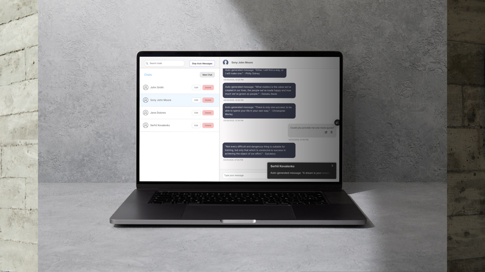

# Chat App (Full Stack)

<p align="center">
  
</p>

## About
This is a lightweight chat application that allows users to create and manage chats, send messages, and receive random quotes as bot responses. The app includes features like auto-messages that send random quotes to random chats every 5 seconds and toast notifications. The frontend is deployed on Vercel, and the backend is hosted on Render.

## Features
- **Chat management:** Create, update, and delete chats seamlessly.
- **Real-time messaging:** Instant updates via WebSocket integration.
- **Random quotes:** Send messages and receive random quotes from the Quotable API.
- **Auto-messages:** Enable auto-generated bot messages that send random quotes to random chats every 5 seconds.
- **Toast notifications:** Display incoming messages as toast notifications.
- **Responsive UI:** Works well on both desktop and mobile devices.

## Tech Stack
### Frontend:
- **React:** For building user interfaces.
- **Socket.IO-Client:** For WebSocket communication.
- **Axios:** For API requests.
### Backend:
- **Express:** Server-side framework.
- **Socket.IO:** For WebSocket integration.
- **MongoDB:** Database for storing chats and messages.
- **Mongoose:** ODM for MongoDB.

## Installation

### Prerequisites:
- Node.js
- MongoDB instance (local or cloud)

### Steps:

1. Clone the repository:

``` bash
git clone https://github.com/your-repo/chat-app.git
cd chat-app
```

2. Navigate to the backend folder and install dependencies:

``` bash
cd backend
npm install
```

3. Set up the environment variables in backend/.env:

```
PORT=5001
MONGODB_URI=<your-mongodb-uri>
SESSION_SECRET=<your-session-secret>
CLIENT_URL=http://localhost:5173
``` 

4. Start the backend server:

``` bash
npm start
```

5. Navigate to the frontend folder and install dependencies:

``` bash
cd ../frontend
npm install
```

6. Start the frontend development server:

``` bash
npm run dev
```

7. Open your browser and visit http://localhost:5173.

## Usage

### Main Features:

- **Chat List:** View all available chats.
- **Create Chat:** Add new chat rooms with customizable names.
- **Real-time Updates:** All changes are instantly visible to other connected users.
- **Bot Messages:** Send messages to receive random quotes as replies.
- **Auto-messages:** Enable automated bot messages sent to random chats every 5 seconds.
- **Toast Notifications:** Display incoming messages in toast notifications.

## Folder Structure
```
chat-app/
├── backend/
│   ├── models/          # Mongoose models
│   ├── routes/          # Express route handlers
│   ├── server.js        # Entry point for backend
│   ├── .env             # Backend environment variables
├── frontend/
│   ├── src/
│   │   ├── components/  # React components
│   │   ├── App.js       # Main React application
│   │   ├── index.js     # Entry point for frontend
│   ├── .env             # Frontend environment variables
└── README.md            # Project documentation
```

## API Endpoints

### Chats:
- ``GET /chats`` - Fetch all chats.
- ``POST /chats`` - Create a new chat.
- ``PUT /chats/:id`` - Update a chat by ID.
- ``DELETE /chats/:id`` - Delete a chat by ID.
### Messages:
- ``GET /messages/:chatId`` - Fetch messages for a specific chat.
- ``POST /messages/:chatId`` - Send a new message to a chat.

## Deployment

### Backend:

- Set up your MongoDB instance.
- Deploy the backend to a hosting platform like Render or Heroku.
- Ensure environment variables are correctly set.

### Frontend:

1. Build the project:

``` bash
npm run build
```

2. Deploy the ``dist/`` folder to a static hosting service like Vercel or Netlify.

## Acknowledgments

- [React](https://reactjs.org/)
- [Express](https://expressjs.com/)
- [Socket.IO](https://socket.io/docs/v4/)
- [MongoDB](https://www.mongodb.com/)
- [Vercel](https://vercel.com/docs)
- [Render](https://render.com/docs#node.js)
- [Quotable API](https://api.quotable.io/) for providing random quotes.